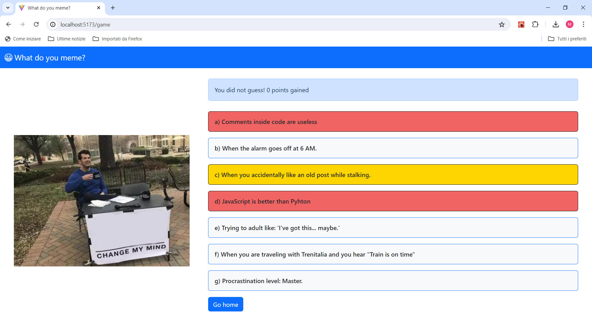
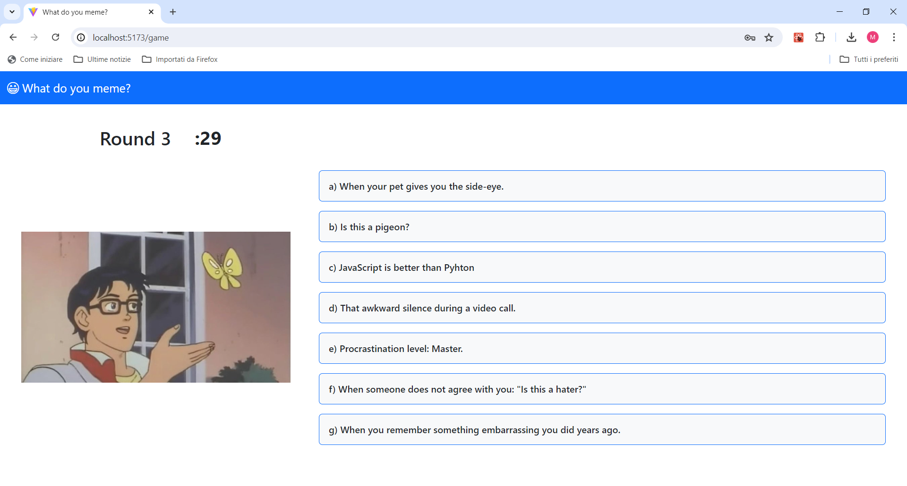

[](https://classroom.github.com/a/J0Dv0VMM)
# Exam #1: "Gioco dei meme"
## Student: s323270 CAZZOLA MICHELE

## React Client Application Routes

- Route `/`: root route, it wraps all the other routes and it contains header and home components  
- Route `/login`: login route, it contains the login component and it is reachable through the home page
- Route `/game`: round game route, it contains the game round component and it is reachable through the home page
- Route `/game-summary`: gamme summary route, it contains the game summary component and it is reachable through the game round component page, at the end of a 3-round game
- Route `/history`: games history (user profile) route, it contains the history component and it is always reachable (for a logged in user), except during a game
- Route `*`: it indicates all the other routes, reachable by typing not valid URLs; it contains the error component 

## API Server
### Authentication and session

#### Login

***URL***: `/api/sessions`

***HTTP method***: POST

***Description***: it performs login

***Request parameters***: None

***Request body content***:
```JSON
{
	"username": "user1",
	"password": "pwd1" 
}
```

***Response code***:
- `201 Created`: success
- `401 Unauthorized`: wrong username and/or password 
- `500 Internal server error`: generic error

***Response body content***:
```JSON
{	
	"userId": 1
	"username": "user1"
}
```

***Access constraints***: None

#### Retrieve user information

***URL***: `/api/sessions/current`

***HTTP method***: GET

***Description***: it retrieves information about the authenticated user, if present

***Request parameters***: None

***Request body content***: None

***Response code***:
- `200 OK`: success
- `401 Unauthorized`: no active session (not authenticated user)
- `500 Internal server error`: generic error

***Response body content***:
```JSON
{
	"userId": 1
	"username": "user1"
}
```

***Access constraints***: it can only be called by a logged in user

#### Logout

***URL***: `/api/sessions/current`

***HTTP method***: DELETE

***Description***: it performs logout

***Request parameters***: None

***Request body content***: None

***Response code***:
- `200 OK`: success
- `401 Unauthorized`: user not authenticated
- `500 Internal server error`: generic error

***Response body content***: None

***Access constraints***: it can only be called by a logged in user

### Meme

#### Retrieve 3-round game data

***URL***: `/api/memes/match`

***HTTP method***: GET

***Description***: it retrieves three different memes, with random criterion, for a 3-round match; for each of them, it also retrieves seven captions, where exactly two are correct for it. 

***Request parameters***: None

***Request body content***: None

***Response code***:
- `200 OK`: success
- `401 Unauthorized`: user not authenticated
- `404 Not found`: data not found
- `500 Internal server error`: generic error

***Response body content***:
```JSON
[
	{	
		"memeId": 2,
		"name": "meme2.png",
		"captions": [
			{
				"captionId": 4,
				"text": "Lorem ipsum"
			},
			...
		]
	},
	{	
		"memeId": 4,
		"name": "meme4.png",
		...
	},
	{
		"memeId": 7,
		"name": "meme7.png",
		...
	}
]
```

***Access constraints***: it can only be called by a logged in user

#### Retrieve single-round game data

***URL***: `/api/memes/single`

***HTTP method***: GET

***Description***: it retrieves one meme with random criterion, together with seven captions, where exactly two are correct for it.

***Request parameters***: None

***Request body content***: None

***Response code***:
- `200 OK`: success
- `404 Not found`: data not found
- `500 Internal server error`: generic error

***Response body content***:
```JSON
[
	{
		"memeId": 6,
		"name": "meme6.png",
		"captions": [
			{
				"captionId": 4,
				"text": "Lorem ipsum"
			},
			...
		]
	}
]
```

***Access constraints***: None

### Captions

#### Retrieve all captions associated with a specific meme

***URL***: `/api/memes/:id/captions`

***HTTP method***: GET

***Description***: it retrieves all captions associated with the specified meme

***Request parameters***:
- `id` - id of the meme to retrieve the associated captions for

***Request body content***: None

***Response code***:
- `200 OK`: success
- `404 Not found`: data not found
- `500 Internal server error`: generic error

***Response body content***:
```JSON
[
	{
		"captionId": 1,
		"text": "Lorem ipsum"
	},
	{
		"captionId": 3,
		"text": "Dolor sit amet"
	},
	...
]
```

***Access constraints***: None

### Match

#### Retrieve all matches completed by a user

***URL***: `/api/matches/history`

***HTTP method***: GET

***Description***: it retrieves all the matches of the current user, together with the information about their rounds

***Request parameters***: None

***Request body content***: None

***Response code***:
- `200 OK`: success
- `401 Unauthorized`: user not authenticated
- `500 Internal server error`: generic error

***Response body content***:
```JSON
[
	{	
		"matchId": 1,
		"date": "2024-05-23",
		"points": 10,
		"rounds": [
			{
				"roundId": 1,
				"meme": "meme2.png",
				"points": 5
			},
			{	
				"roundId": 2,
				"meme": "meme5.png",
				"points": 5
			},
			{
				"roundId": 3,
				"meme": "meme5.png",
				"points": 0
			}
		]
	},
	...
]
```

***Access constraints***: it can only be called by a logged in user

#### Insert data about a completed match

***URL***: `/api/matches`

***HTTP method***: POST

***Description***: it inserts data about the match completed by the current user

***Request parameters***: None

***Request body content***: 
```JSON
[
	{	
		"roundId": 1,
		"memeId": 2,
		"name": "meme2.png",
		"guessed": true
	},
	{
		"roundId": 2,
		"memeId": 5,
		"name": "meme5.png",
		"guessed": false
	},
	{
		"roundId": 3,
		"memeId": 8,
		"name": "meme8.png",
		"guessed": false
	}
]
```

***Response code***:
- `201 Created`: success
- `401 Unauthorized`: user not authenticated
- `500 Internal server error`: generic error

***Response body content***: None

***Access constraints***: it can only be called by a logged in user


## Database Tables

- Table `user` - it is associated with a registered user:
  - `UserId`: identifies a registered user
  - `Username`: unique in the database
  - `Password`: encrypted password
  - `Salt`: salt associated with the given password
- Table `match` - it is associated with a complete (3-round) match:
  - `MatchId`: identifies a match
  - `UserId`: user who played the match
  - `Date`: date and time of the match, in format `YYYY-MM-DDThh:mm:ss`
- Table `round` - it is associated with a single round of a match:
  - `MatchId`: it refers to the associated match and it identifies a round together with _roundId_ ; it forms a unique index with _memeId_
  - `RoundId`: it identifies a round together with _matchId_ and it has a value between 1 and 3
  - `Guessed`: boolean (stores as an integer equal to 0 or 1) that indicates whether the user has chosen the correct caption for the round
  - `MemeId`: it refers to the meme shown during this round (it forms a unique index together with _matchId_)
- Table `caption`: - it is associated with a caption:
  - `CaptionId`: it identifies a caption
  - `Text`: caption text, unique in the database
- Table `meme`: - it is associated with a meme:
  - `MemeId`: it identifies a meme
  - `Name`: meme name (with extension), with relative path in the folder `/meme/`
- Table `correct_caption` - it represent a N-to-N association among memes and their correct captions:
  - `CaptionId`: it refers to the caption
  - `MemeId`: it refers to the meme

## Main React Components

- `App` (in `App.jsx`): application skeleton, wraps all other components and handles session retrieval
- `HomeComponent` (in `HomeComponent.jsx`): homepage at the root path, handles navigation to other components
- `LoginComponent` (in `LoginComponent.jsx`): it contains a login form in the center of the page, with the possibility of returning to the homepage
- `HeaderComponent` (in `HeaderComponent.jsx`): header of all the application pages, handles navigation to user page, logout and homepage
- `GameRoundComponent` (in `GameRoundComponent.jsx`): it contains the game elements (timer, meme, captions, round result at the end)
- `GameSummaryComponent` (in `GameSummaryComponent.jsx`): it contains the final result of a 3-round game, with total points gained, memes guessed and their selected captions
- `HistoryComponent` (in `HistoryComponent.jsx`): it contains the history of past games of the user (if logged in), showing some user statistics and the details for each game
- `NotFoundComponent` (in `NotFoundComponent.jsx`): error page, used to handle invalid routes; it allows to reach the home page and to access all the functionalities inside the header component

## Screenshot

***Screenshot of a guest user who made a wrong choice for the meme***



***Screenshot of a logged in user while playing the third round of the game, with 29 seconds left***



## Users Credentials

- First user:
  - *username*: `test1`
  - *password*: `pwd1`
- Second user:
  - *username*: `test2`
  - *password*: `pwd2`
- Third user (clean):
  - *username*: `mike`
  - *password*: `mike`
